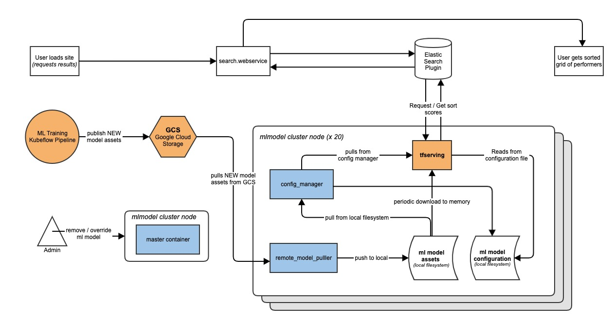

## **What is model.manager?**
model.mananger is a tool to deploy ATG machine learning models. It consists of 3 python webservices developed in house(`master`, `config_manager`, `remote_model_puller` and one external dependency(`tfserving`) running as docker container orchestraed in docker swarm cluster.

Our machine training models are currently trained in Google cloud service periodically and stored in Google storage. This model.manager is developed to get the latest models into ATG network automatically for production usage.

## System Diagram

## **Structure of  model.manager**
### tfserving
It is Tensorflow serving container which serves and represents our ML models. It is called by Serch Elasticsearch via gRPC connections. 
It reads a model configuration file from local file systems and load the corresponding model assest stored on local.
This container should be deployed globally along with `config_manager` and `remote_model_puller`, and takes most of the node resources available on each node.

### master
Responsible of administrative operations to occur on the cluster. The `master` container keeps a list of registered `config_manager` and `remote_model_puller` nodes. It allows users to perform operations across the entire cluster, and to read/change remote model state as well.

### remote_manager
Periodically this webservice tracks what models are available on a defined gcs bucket, then pulls the most recent/current models down to local file system. This local file system is shared with `config_manager`
It is deployed globably in the cluster along with `config_manager` and `tfserving`. It is s only accessible within the cluster via port of 8001 to communicate with master.  The `master` container will call it to initiate admin calls.

### config_manager
Periodically this webservice tracks what models are available on local and tracks what `tfserving` knows about, and keeps `tfserving` up to date with available models, also removes models that are no longer valid to clean up disk space.
It is only availale by port `8002` within the cluster to communicate with `master`. The `master` container will call it to initiate admin calls.

## Local Development
* Run `docker-compose up --build -d` and have all containers running and healthy. You can check container status by running `docker ps`.
* Run `docker-compose run fill_remote_directory_with_models` to create some fake models on remote GCS bucket for testing purpose.
* Run `docker-compose run tests` to run integeration tests.
*
